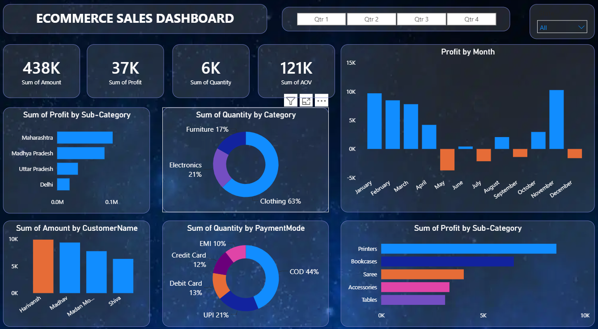

# E-Commerce Sales Dashboard | Power BI

## Overview

An interactive E-Commerce Sales Dashboard built using Microsoft Power BI to analyze sales performance and generate meaningful business insights.

## Dashboard Features

- Total Sales
- Total Profit
- Total Quantity
- Average Order Value (AOV)
- Monthly Profit Analysis
- Profit by Sub-Category
- Quantity by Category
- Sales by Customer
- Quantity by Payment Mode
- Quarter-wise analysis
- Interactive filters and visual interactions

## Tools & Technologies

- Microsoft Power BI
- DAX
- Data Visualization
- Data Analysis
- Data Modeling

## Key Insights

The dashboard provides an interactive view of:

- Sales and profit performance
- Monthly trends
- Product category performance
- Customer-level sales
- Payment mode distribution
- Sub-category profitability

## Dashboard Preview

## Project Demo

A video demonstration of the interactive dashboard is included in this repository.

## Purpose

This project was created to practice data analysis, visualization, dashboard development, and business intelligence using Power BI.
